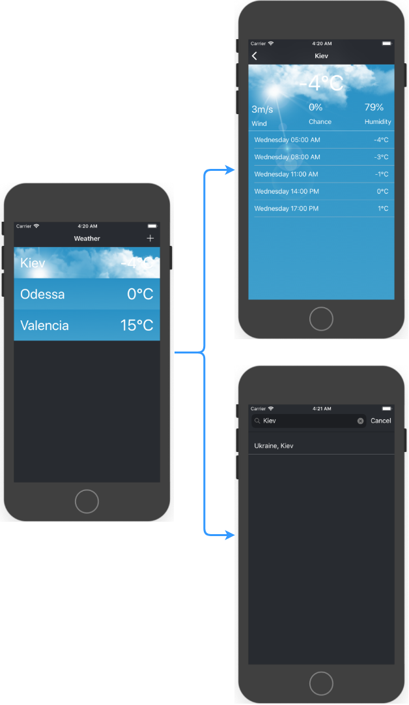
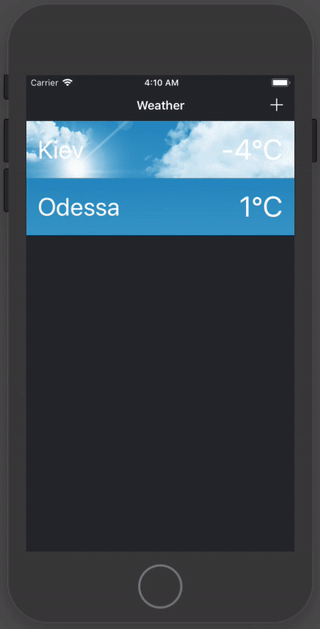

Тестовое задание 
==================

Необходимо показать умение владением стека технологий: sqlite (sql/coredata), json (xml), API (rest), offline mode, git.

## Что надо сделать:

* Необходимо создать погодное приложение. Приложение должно иметь минимум 2 встроенных города (Kyiv, Odessa), пользователь может добавить свой город. Приложение должно выводить города с указание температуры, приложение должно уметь показывать более подробную информацию по городу и уметь показывать прогноз погоды (3 или 7 дней). http://developer.yahoo.com/weather/, или на http://openweathermap.org/API, или любой другой на выбор.
* Обязательная реализация CRUD, для работы с данными.
* Приложение обязано соблюдать design, code guidelines и свободно работать в offline режиме, а так же использовать систему управления зависимостями, к примеру CocoaPods.
* Вы можете использовать любые библиотеки для ускорения разработки, за исключением использования кода библиотек, который покрывает больше 50% функционала данного задания.

## Приложение:

* UI Scheme

* Gif

